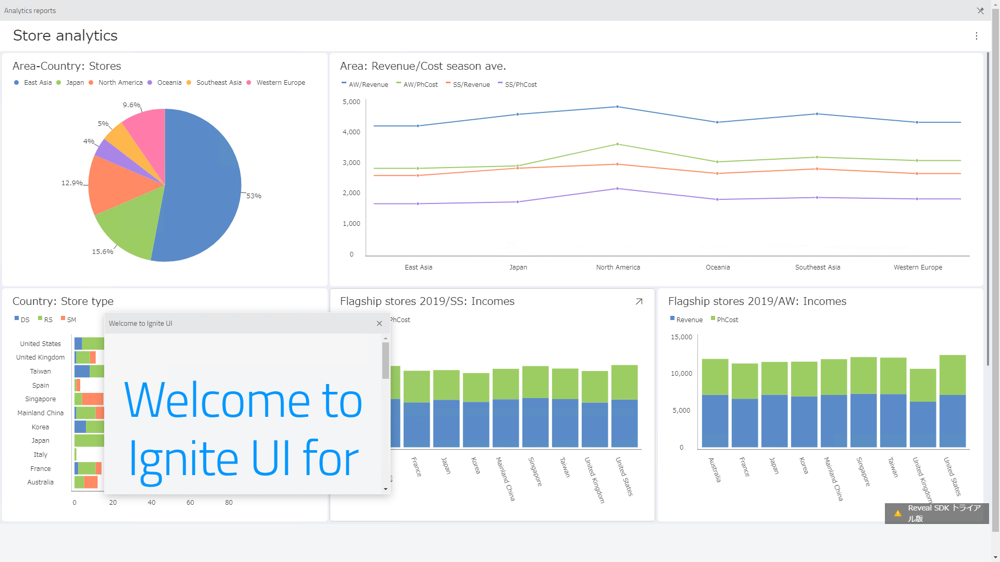

# Ignite UI for Angular (DockManager, Grids, Charts...) + Reveal Dashboard

folders
- server : Reveal Web SDK Server application -> Build and run with Visual Studio
- client : Ignite UI Web application -> After npm installation, run "npm start" or "ng build"
